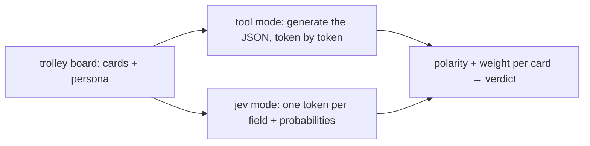

# TL;DR

<details>
	<summary>Show Summary</summary>
	<p>An LLM morally scores the victims on each track of a trolley party game, and I graded it against a hand-authored fixture: four models × two serving modes — write the JSON (tool-call) vs pick the tokens (Jev-style). Picking won hard on the local small model (writing took ~10 min per persona) and gave back a few points on the strong cloud models. Same weights, different serving mode = same accuracy, different failure rows — full ladder inside.</p>
</details>

# 1. Trial by Trolley

![[candh_trolley.jpg]]

So there's this game made by Cyanide and Happiness called [Trial by Trolley](https://store.explosm.net/products/trial-by-trolley?srsltid=AU7gw4URaZy8EcZYiZXK1Nzv5y8xf1Vf93D5KvRK0ISM9uak4dM90FON) that was inspired by the [Trolley Problem](https://en.wikipedia.org/wiki/Trolley_problem). 

In the original problem, there are two tracks, each with people stuck onto them, and you as the conductor need to decide where to steer the trolley based on your moral principles. C&H took that idea and made it into a board game where you play as teams, and you keep adding victims on either your team's tracks or the tracks of your opponents to make the conductor steer the trolley onto the enemy team's tracks.

Me and a friend of mine always thought it would be fun to make the **conductor** for this game an LLM, so players could mess around with its "morality" through prompt-injection or something like that. So I took the opportunity to use the game to evaluate how different models behave.

# 2. My take on the game

Our game cards look something like:

```json
{
	"innocents": [{
		"id": "baby",
		"text": "a baby asleep in a shopping cart",
		"polarity": "positive",
		"weight": 0.9,
		"tags": ["person", "child"]
	}...],
	"sinisters": [{
		"id": "murderer",
		"text": "a convicted murderer out on parole",
		"polarity": "negative",
		"weight": 0.6,
		"tags": ["person", "villain"]
	}...]
}
```

Polarity and weight fold into a single **value** on \[-1, 1\]: positive means the world loses something good if the trolley hits it, negative means hitting it is basically a mercy (the murderer, the plague carrier).

These are the options for a baseline **neutral** judge. On top of that, personas like utilitarian, bureaucrat and soft-hearted act as nudge the baseline scores.

> [!example] One board, different verdicts
> Say the **left track** holds a sleeping baby, and the **right track** holds a doctor and a reformed murderer 
> 
> A **utilitarian** will steer right without blinking: hitting that side costs `0.85 + (−0.6) = 0.25` against the baby's `0.9` — fewer lives, and the murderer's death comes free
> 
> A **soft-hearted** judge will give a second chance to the reformed villain (him being reformed pulls his score toward "victim") so now hitting him *costs* the world something and the right track adds up to ~1.5 - suddenly the baby looks like a smaller loss

# 3. How the judge decides

The judge looks at each card and produces two things for it:
- the input: a string containing the card's description ("a baby asleep in a shopping cart")
- the output: polarity (positive, negative) and weight (0-1, trivial to unspeakable)

I pre-defined the values I expect the LLM to produce, then evaluate how good an LLM is based on:
- **hit rate** - how many graded rows land inside their expected band
- **Mean Absolute Error** - between expected and output weight
- **response time** - how long the whole sweep took

To make exchange equal blows, I've compared:
- **tool mode** - have the LLM write the JSON answer, token by token, through a tool call
- **Jev mode** - have the model pick each answer from a fixed list of options, one token per field, with real probability scores attached



If you need a reminder on how Jev works, you can read about in in [[Jev|this blogpost]]. These are the "actual numbers" I promised there: in that one I explained the concept, we look at the backing.
# 4. The serving ladder

Same weights - different ways of serving them. The metric is the **litmus hit rate** over 15 rows like "a bus full of kids vs a baby in a stroller" across different personas. A row passes when the judge's value lands inside its expected band.

| Weights                      | writing (tool-call)         | picking (jev)  | Δ                 |
| ---------------------------- | --------------------------- | -------------- | ----------------- |
| gemma4:31b (ollama-cloud)    | 87%                         | 80%            | −7pp              |
| gpt-5.4-mini (azure)         | 80% (batched)               | 67%            | −13pp             |
| Bonsai 2 27B ternary (local) | 80%                         | 80%            | tie               |
| qwen3.8:27b FP16 (local MOE) | ~10 min/persona (unusable)  | 87% in 118 s   | picking, duh      |
We see that the bigger the model is, the more accurate the outputs, at the cost of inference time (duh!)

# 5. What actually broke

The accuracy rate stays roughy within 67–87% for all models, but **which** rows fails is pretty much lottery. Same weights, different flops:

## 5.1. Scenario 1 - The mercy hedge
We expect **the bureaucrat** to score a convicted war criminal firmly in villain territory (−0.8).

In tool mode, every model nails it (−0.80, −0.90). In Jev mode, all three models read him as **−0.05** - making him closer to a jerk, rather than a villain. What's interesting is that these are 3 different models, trained differently, that fail the same.

> [!note] Hand-wavy hunch
> Because we lose context from the thinking part, the level encoding eats the strong-negative mass when the answer is one picked token instead of free text

## 5.2. Scenario 2- Twins vs the school bus
**We expect the utilitarian** to score twin toddlers *below* a bus of kids (two lives < headcount). 

On the two cloud models, Jev mode pushed the twins up into school-bus territory (+0.80) while the same weights in tool mode kept them humbly at +0.40–0.60.

## 5.3. Scenario 3 - Didn't punish the fish-microwaver
We expect the office jerk who microwaves fish in the shared microwave to stay at polite-jerk level even for the soft-hearted judge (they may forgive, not inflate). 

Cloud picking scored him **+0.20** - making it into an act of kindness. The **soft-hearted persona** overcorrected so hard it started defending his actions.

## 5.4. Unbatching the board 
Scoring each card in isolation maybe be a food idea to reduce latency, but when relationships between units matter - this may be detrimental. 

The soft-hearted murderer-with-a-secret-good-deed rows scored **−0.78 / −0.90** alone but **+0.52 / +0.47** batched with board context (when the LLM was able to see other cards). Alone, the good deed can't rescue him; with the whole board in view, it can.

## 5.5 Infra war stories 
Ollama-cloud returned silent 200s with *empty logprobs* on 17/17 models I probed - so you'll need to scout for providers that provide logprobs for multiple output tokens. 

Oh, and a cache-thrash config made everything 4.5× slower; a quick-wins fix took per-request time from **7.6 s to 0.20 s**. TODO: mention what cache-trash and quick wins means

Todo: also mention how we implemented jev locally - cuz that's neither here nor in the other post. about using top logits + softmax and flooring missing tokens to 0.0 
# 6. Confidence in practice

A thing I saw was that smaller models tend to be more confident than bigger ones, when doing Softmax on their logits. This makes sense, since the model was not specifically trained to be good at it (RLHF vs RLCD)

What's interesting tho is that the winner's **raw probability mass** and the **margin** over the runner-up. Over all my experiments, the models mostly agree

All in all, we can call the confidence is **informative, not calibrated**. On the open-path runs, wrong answers averaged ~0.62 confidence on their weakest field vs ~0.80 for right ones

# 7. The code

> [!info] About the repo
> There's code backing all of this, but it's pretty much a dumping ground for my investigation — decision logs, probe logs, half-finished phases. It's clearly not made as learning material; but you can definitely find something interesting there yourself, or with some LLM help.

You can checkout the code that was used to generate these results at [2BytesGoat/trolley-problem](https://github.com/2BytesGoat/trolley-problem) 

# Summary

- I tried using LLMs both via tool mode and Jev mode - accuracy seems stable, but if the failures are in different places
- Defining the system prompt is even more important, because that's the only context the LLM will have when producing the results
- Treat the confidence number as informative - you should evaluate it on a few examples before you decide on an actual threshold 
# Where next

- Backward: [[Jev]] — the concept, the hype audit, the portable recipe
- Deeper: [InsiderLLM's local write-up](https://insiderllm.com/guides/what-is-jev-typesafe-explained-local/)