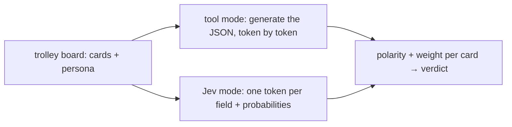

# TL;DR

<details>
	<summary>Show Summary</summary>
	<p>I wanted to see whether an off-the-shelf LLM can be forced into answering like Jev model without additional training. While it technically worked and it was faster, the confidence was rubbish and you're better off making a custom tool for your LLM to populate JSONs with. Four models × two serving modes on one fixture - full ladder inside.</p>
</details>

# 1. Trial by Trolley

![[candh_trolley.jpg]]

So there's this game made by Cyanide and Happiness called [Trial by Trolley](https://store.explosm.net/products/trial-by-trolley) that was inspired by the [Trolley Problem](https://en.wikipedia.org/wiki/Trolley_problem).

In the original problem, there are two tracks, each with people stuck onto them, and you as the conductor need to decide where to steer the trolley based on your moral principles. C&H took that idea and made it into a board game, where you play as teams, and you keep adding victims on either your team's tracks or the tracks of your opponents to make the conductor steer the trolley onto the enemy team's tracks.

Me and a friend of mine always thought it would be fun to **make the conductor an LLM**, so players could mess around with its "morality" through prompt-injection or something like that. So I took the opportunity to use the game to evaluate how different models behave.

# 2. My take on the game

Our game cards look something like:

```json
{
	"innocents": [{
		"id": "baby",
		"text": "a baby asleep in a shopping cart",
		"polarity": "positive",
		"moral_weight": 5,
		"tags": ["person", "child"]
	}, ...],
	"sinisters": [{
		"id": "murderer",
		"text": "a convicted murderer out on parole",
		"polarity": "negative",
		"moral_weight": 4,
		"tags": ["person", "villain"]
	}, ...]
}
```

Polarity and weight fold into a single **value** on \[-1, 1\]: positive means the world loses something good if the trolley hits it, negative means hitting it is basically a mercy (the murderer, the plague carrier). The curated 1-5 `moral_weight` hint just gets normalized onto that scale.

These are the options for a baseline **neutral** judge. On top of that, personas like utilitarian, bureaucrat and soft-hearted act as nudges on the baseline scores.

> [!example] One board, different verdicts
> Say the **left track** holds a sleeping baby, and the **right track** holds a doctor and a reformed murderer.
>
> A **utilitarian** will steer right without blinking: hitting that side costs `0.85 + (-0.6) = 0.25` against the baby's `0.9` - fewer lives, and the murderer's death comes free.
>
> A **soft-hearted** judge will give a second chance to the reformed villain (him being reformed pulls his score toward "victim") so now hitting him *costs* the world something and the right track adds up to ~1.5 - suddenly the baby looks like a smaller loss.

# 3. How the judge decides

The judge looks at each card and produces two things for it:

- the input: a string containing the card's description ("a baby asleep in a shopping cart")
- the output: polarity (positive, negative) and weight (0-1, trivial to unspeakable)

I pre-defined the values I expect the LLM to produce, then evaluate how good an LLM is based on:

- **hit rate** - how many graded rows land inside their expected band
- **Mean Absolute Error** - between expected and output weight
- **response time** - how long the whole sweep took

To keep the exchange fair, I've compared:

- **tool mode** - have the LLM write the JSON answer, token by token, through a tool call
- **Jev mode** - have the model pick each answer from a fixed list of options, one token per field, with real probability scores attached



If you need a reminder on how Jev works, you can read about it in [[Jev|this blogpost]]. These are the "actual numbers" I promised there: that one explains the concept, this one looks at the backing.

# 4. Faking Jev on a cloud API

Jev itself is closed and available only via API. The trick is that LLMs already generate probabilities for the next output token in a sequence - so we can just yoink the top 20 and their probabilities and do a fake Jev approach. 

Here are three moves:
1. **Ask for one token** - shape the question so the answer is a single token. The client uses letter proxies (`A` = level 1, `B` = level 2...) because letters are always single tokens and never collide with prose openers like "The"
2. **Read the distribution** - one request with `temperature: 0, max_tokens: 1, logprobs: true` returns the top-K next tokens with their real probabilities (the model's actual opinion before it commits to an answer)
3. **Clean up** - keep your candidates, zero out the missing ones, renormalize over what's left (apply something like Softmax). Out comes the model's pick plus a "confidence" per field

A few caveats:
- **The window you get is provider-dependent** - which makes that zeroing step load-bearing. 
* **Thinking models poison the window** - the first token becomes a think-tag, so you'll need to run them in **no-think** mode.

# 5. The serving ladder

Same weights - different ways of serving them. Every arm runs the same 15-row litmus fixture, same boards, temp 0.

| Model                           | How it answers                         | Time/ answer | Whole sweep | Sanity  |
| ------------------------------- | -------------------------------------- | ------------ | ----------- | ------- |
| **gemma4:31b** (ollama-cloud)   | writes the board (4 calls)             | 0.11 s       | 3.4 s       | **87%** |
|                                 | picks per field, 8 draws ᐟ (243 calls) | 1.40 s       | 42.0 s ᐟ    | 80%     |
| **gpt-5.4-mini** (azure-cloud)  | writes per card (15 calls)             | 0.47 s       | 14.2 s      | 73%     |
|                                 | picks per field (31 calls)             | 0.62 s       | 18.5 s      | 60%     |
| **Bonsai 2 27B** (laptop, free) | writes the board (4 calls)             | 1.58 s       | 47.4 s      | 80%     |
|                                 | picks per field (31 calls)             | 3.34 s       | 100.1 s     | 80%     |
| **Llama-3.2-1B** (laptop, free) | writes per card (60 calls)             | 0.86 s       | 25.7 s      | 47%     |
|                                 | **picks from cache** (3 calls)         | **0.03 s**   | 0.9 s       | 47%     |

> ᐟ = sampled, not exact: ollama-cloud strips logits (that's the whole gemma disclaimer)

Same answers under both modes - the difference is the shape: picking re-reads the whole instruction sheet per answer (394 vs 122 tok) but writes nothing. Unless the prompt is cached - then it's 30 tok and 0.03 s.

# 6. What actually broke

The accuracy spans 47-87% across the ladder, but inside a given model's weights it stays in a narrow band - it's **which** rows fail that's basically a lottery. Same weights, different flops:

## 6.1. Scenario 1 - The mercy hedge

We expect **the bureaucrat** to score a convicted war criminal firmly in villain territory (-0.8).

In tool mode, every model nails it (-0.60, -0.70, -0.86). In Jev mode, every arm read him as **-0.05** - closer to a jerk than a villain - and gemma did it with a raw **1.00** confidence. What's interesting is that these are 3 different models, trained differently, that fail the same.

> [!note] Hand-wavy hunch
> When the answer is one picked token instead of free text, the model can't hedge its way to the extreme level in prose - so the level encoding eats the strong-negative mass. Unverified, but it reproduced every single time.

## 6.2. Scenario 2 - Twins vs the school bus

We expect **the utilitarian** to score twin toddlers *below* a bus of kids (two lives < headcount).

On the cloud models, Jev mode pushed the twins up into school-bus territory (+0.80) while the same weights in tool mode kept them humbly at +0.20-0.90 - and gpt's per-unit tool arm failed here *too* (+0.90): part of that Jev drop is just losing the board, not picking. Bonsai-jev kept them right at +0.15 while Bonsai-chat drifted to +0.75 - the failure can flip sides per arm, which is exactly the "lottery" framing below.

## 6.3. Scenario 3 - Didn't punish the fish-microwaver

We expect the office jerk who microwaves fish in the shared microwave to stay at polite-jerk level even for the soft-hearted judge (they may forgive, not inflate).

Picking scored him **+0.20** on gemma - making it into an act of kindness, with the full-confidence flex on top. But the same row failed nearly everywhere this session (gemma-chat and both Bonsai arms at +0.00, 1B at ±0.00-0.05) - only the two gpt chat arms actually passed it. The fixture row is just brittle the moment a judge wants to be nice about dignity.

## 6.4. Unbatching the board

Scoring each card in isolation may look like a good idea for latency, but when relationships between units matter, it backfires. The per-unit Jev arms see the card without its board (one unit per request), the batched tool arms see the whole board in one call - and the same card tells two different stories.

From this session: the soft-hearted murderer-with-a-secret-good-deed scored **-0.20** per-unit on the 1B fork vs **+0.05** batched, and gemma landed +0.50 picking vs **+0.70** with the board in view; gpt's own tool twins split the same way (+0.72 batched / -0.74 per-unit). Alone, the good deed can't reliably rescue him; with the whole board in view, it usually can.

## 6.5. Local infra war stories

**The silent 200** - Ollama-cloud returned HTTP 200s with *empty logprobs* on all 17 models I probed. Fix: probe once at startup - send a one-token request and assert the logprobs field actually ships - and fail loudly. Otherwise you silently degrade into uncalibrated greedy picks that still look like answers.

**The cache thrash** - The llama.cpp decision fork serves its answers off one cached prompt at a time, and alternating personas between calls kept evicting it - a measured 4.5× slowdown until everything batches by persona.

**The default llama-server** - A fresh llama-server install ran every request at 7.6 s. Two flags (`--parallel 1 --cache-ram 24576`) plus serial requests cut it to **0.20 s** warm - 38× - by giving the prompt cache room and one slot to live in. That 0.20 s request is the best case of the whole ladder: a Jev pick served off a pre-cached prompt, where the answer is read from the logits window instead of generated.

# 7. Confidence in practice

A thing I saw was that the confidences come out in completely different shapes depending on the serving class - and model size was not the driver 

I thought "smaller models are more confident" (cuz you know dumb people think they smart) but the logs say the opposite: 
- the local ternary 27B read humble all over Bonsai-jev's picks (0.11-0.51, wrong rows at 0.11-0.48) - and the 1B fork's whole window sits flat under 0.75
- while gemma 31b threw a raw **1.00** on its *wrong* war-criminal pick (and again on soggy_cereal)

That's mainly cuz the model was never trained to focus on token confidence (see RLHF-vs-RLCD gap from [[Jev]]).

All in all, the confidence is **informative, not calibrated** - and in shape, not just level: on the azure-cloud arm wrong picks sat at 0.15-0.56 while its correct picks ran 0.19-0.67 (usable signal, weak separation); on gemma the wrong picks *were* the most confident ones. Treat it as a per-model diagnostic you evaluate on a few examples first, not a ground truth.

# 8. The code

> [!info] About the repo
> There's code backing all of this, but it's pretty much a dumping ground for my investigation - decision logs, probe logs, half-finished phases. It's clearly not made as learning material; but you can definitely find something interesting there yourself, or with some LLM help.

You can check out the code that was used to generate these results at [2BytesGoat/trolley-problem](https://github.com/2BytesGoat/trolley-problem).

# 9. Summary

- I tried using LLMs both via tool mode and Jev mode - on strong weights accuracy barely moves, on the small local model both modes are equally lost; the failures land in different places either way
- Defining the system prompt is even more important, because that's the only context the LLM will have when producing the results
- Treat the confidence number as informative - you should evaluate it on a few examples before you decide on an actual threshold

# Where next

- Backward: [[Jev]] - the concept, the hype audit, the portable recipe
- Deeper: [InsiderLLM's local write-up](https://insiderllm.com/guides/what-is-jev-typesafe-explained-local/)