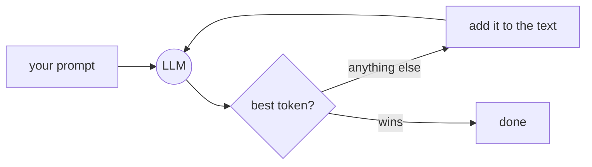

---
tags:
  - llms
draft: true
date: 2026-09-18
---

# TL;DR

<details>
	<summary>Show Summary</summary>
	<p>An LLM (also known as a Large Language Model) is a fancy autocomplete engine: a big formula that, given some text, assigns a probability to every token that could come next. It "writes" by adding the best token back onto the text and feeding the whole thing in again, until a special <code>&lt;end&gt;</code> token wins. Training happens in two phases: autocomplete the internet, then learn from human thumbs.</p>
</details>

# The autocomplete bar

Open Google, start typing "weath" — the bar suggests the rest. An LLM plays the same game, except the suggestion bar finishes the whole sentence, one token at a time.

That's it. That's the magic trick. The rest of this post is just that sentence, unpacked.

# The next-word game

Take the sequence "Ana are ...". The LLM doesn't give you one answer — it gives a **probability for every token in its dictionary** to follow that sequence. "Mere" (Romanian for apples) is simply the token with the highest probability.

Same shape as the rain-chance output in [[Linear Regression]] — except here the model outputs a chance for every token at once.

# The dictionary is made of tokens

You can't fit every word of the internet into a dictionary — tomorrow the trolls invent "skibbidy" and you don't want to re-train the whole AI for one word. So the dictionary holds syllables and letters instead. No "skibbidy" entry? No problem — glue "ski" + "b" + "bi" + "dy".

Word pieces, syllables, letters — they're all called **tokens**. The chopping itself is a separate step (the tokenizer) and it's not something the model learns during training. That's a story for the architecture post.

# The generation loop

But how does one-word autocomplete become whole paragraphs? Predict one token, **add it to the text**, feed the whole thing back in. Predict, add, repeat.

Say you want the lyrics to the Pokemon intro, so you ask: "Continue the intro for the pokemon theme song: I wanna be ...". The LLM predicts "the" — we add it and feed it back. It predicts "very" — add, feed back. And so on, until it predicts **`<end>`**: a special stop token that sits in the dictionary like any other, with its own probability of showing. When it wins, the model stops generating and waits for your next question.

![[TokenGeneration.gif]]



In pseudo-code, that's the whole "AI":

```python
prompt = "Ana are ..."
while True:
    next_token = llm.predict_next(prompt)  # scores every token in the dictionary
    if next_token == "<end>":
        break
    prompt = prompt + next_token
```

# How it learned: two phases

The old way (GPT2 era) was just **phase 1**: feed it the internet and train it to autocomplete as hard as it could — no chatbots, just autocomplete. The side effect is that it memorizes facts, cuz learning what comes next in a sequence is the same muscle as learning a poem by heart. You can't finish the poem without knowing the poem.

The new way adds **phase 2**: make it talk like a human. The LLM generates answers, a human looks at them and decides whether they like the answer or not, and the model is trained to produce more answers that get the thumbs. **Like / don't like becomes the reward function** it optimizes for. (Multiple humans disagreeing? Average the answers or hold a vote — topic for another time.)

# Gotcha: it's a mirror, not a brain

> [!warning] Garbage in, "diabet" out
> The LLM was trained on a lot of text from the internet, without actually checking if it's good. If there's a meme trend or enough trolls, other words can end up with higher probabilities — and the model may confidently finish "Ana are ..." with "diabet" (Ana has diabetus), just because "diabet" showed up more often in the data it saw.
>
> Some scientists put filters, some don't — depends on how fast they need to release new LLMs in the wild. One approach is to use other LLMs to check the data and flag bad entries for humans to review or remove. Either way: **fluent autocomplete is not understanding**.

# Summary

- An LLM is a next-token predictor — a probability leaderboard over its dictionary
- The dictionary is made of tokens (word pieces, syllables, letters), chopped by a tokenizer
- Generation = predict → add it to the text → feed it back in → repeat until `<end>` wins
- Phase 1: autocomplete the internet (facts come along for free). Phase 2: human thumbs become the reward
- Fluent output ≠ truth — the model mirrors its training data

# Homework

> [!todo] Try it yourself
>
> - [ ] Open any chatbot and ask it to continue "Ana are ..." — then ask what other words were in the race (15 min)
> - [ ] Find a prompt where the model confidently states something wrong — that's the mirror at work
> - [ ] **Stretch:** play [[Prompt-it!]] and crack a level by thinking in next-token probabilities
>
> Stuck? → [[AI vs ML vs DL]]

# Where next

- Backward: [[AI vs ML vs DL]] — where LLMs sit under the AI umbrella
- Forward: [[Prompt-it!]] — an LLM misbehaving in the wild
- Deeper: [Andrej Karpathy — Intro to Large Language Models](https://www.youtube.com/watch?v=zjkBMFhNj_g)
