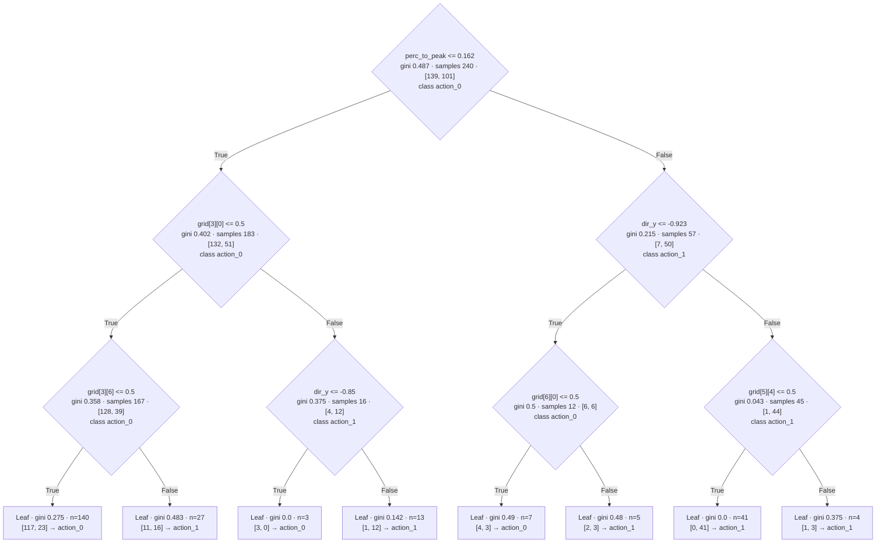

---
tags:
  - classical-ml
draft: false
date: 2026-04-17
---
# What are Decision Trees

It's basically an algorithm that generates nested `if-else` statements based on the data you give it. So instead of you hand-writing rules, the algorithm learns them from examples.

> *How hard can Machine Learning be ... you're basically making just some if-else statements* 

They're also the thing your friends will use to make fun of you when you tell them you're doing Machine Learning. 
## Why you should care

Well... if you want to make an AI using `if-else` statements (say for [DragonJump](https://github.com/2BytesGoat/PLaiGROUND/blob/main/scripts/01_if_else_agent.py)), getting the desired behavior means tweaking conditions manually. And that takes time and effort. 

Instead, you could capture a few examples of the behavior you want and feed them to a Decision Tree. Its goal is to do the mapping for you.
# How they work

Imagine you want to build an AI that helps you decide whether you should take an umbrella. 

The action (sometimes called prediction **target** or simply **y**) is: 
- take 
- don't take

And your features (things that help you take the decision) can be:
- humidity 
- chance of rain
- wind

You'll then keep a journal of weather conditions and whether you took or left your umbrella.

Then the Decision Tree will:
1. build multiple conditions for each feature
2. evaluate how well each condition splits your data
3. choose the condition that produces the best separation
4. repeat steps 1-3 until you're happy with the results
# Classification vs Regression Trees

## Classification Tree
Use this when your output is a category:
- spam / not spam
- fraud / not fraud
- cat / dog

## Regression Tree
Use this when your output is a number:
- house price
- energy consumption
- delivery time

# What makes a "good split"

At each step, the algorithm tries a bunch of possible splits and picks the one that separates outcomes best.

For classification, you'll usually hear terms like:
- Gini impurity
- entropy / information gain

For regression, you'll usually hear:
- mean squared error reduction

I'm not going to throw in any complicated formulas here, but if you want to dive deeper into the topics, I can't recommend enough [StatQuest](https://www.youtube.com/@statquest). Precisely:
- The series on Decision and Classification Trees - [YouTube - Part 1](https://www.youtube.com/watch?v=_L39rN6gz7Y) and [YouTube - Part 2](https://www.youtube.com/watch?v=wpNl-JwwplA)
- Regression Trees, Clearly Explained - [YouTube](https://www.youtube.com/watch?v=g9c66TUylZ4)

# Why trees are awesome

- **Interpretability**: you can inspect the actual logic.
- **Low prep overhead**: often works without heavy feature scaling.
- **Non-linear behavior**: can model decision boundaries that linear models miss.
- **Fast baseline**: gives you a quality reference quickly.

# Where they struggle

- They can overfit if you let them grow too deep.
- Small data changes can produce a different tree (they're kinda unstable).
- A single tree can get outperformed by stronger ensemble methods.

That's why people often move to Random Forests or Gradient Boosted Trees later - same idea, just many trees working together.

# Anti-overfitting knobs (the important ones)

When a tree memorizes training data, it looks smart in training and goofy in production.

Common control knobs:
- `max_depth` - limits the number of branches a tree can have
- `min_samples_split` - minimum samples to create a new split
- `min_samples_leaf` - minimum samples in each final leaf
- `max_leaf_nodes` - limits total number of leaves

If training performance is great but validation drops, your tree is probably overfitting.

# Quick starter code (scikit-learn)

```python
from sklearn.tree import DecisionTreeClassifier
from sklearn.model_selection import train_test_split

# X = your feature matrix, y = labels
X_train, X_test, y_train, y_test = train_test_split(
    X, y, test_size=0.2, random_state=42
)

model = DecisionTreeClassifier(
    max_depth=4,
    min_samples_leaf=10,
)

model.fit(X_train, y_train)
accuracy = model.score(X_test, y_test)
print(f"Accuracy: {accuracy:.2f}")
```

# Tiny example

In your [[How to DragonJump]] setup, the tree predicts what action to take at each frame.

Features:
- `state` (one observation vector per frame)

Target:
- `action` (the move to execute)

What's inside `state`:
- a flattened frame grid (`7 x 7` -> `49` values)
- plus `8` extra signals:
  - `dir_x`, `dir_y`
  - `vel_x`, `vel_y`
  - `on_floor`, `on_wall`
  - `perc_to_peak`, `has_powerup`

So each training sample has `57` input features in total (`49 + 8`). In the usual layout, indices `0 … 48` are a **row-major** flatten of `grid[row][col]` (`row = i // 7`, `col = i % 7`); indices `49 … 56` are the eight signals in the order above (`dir_x` … `has_powerup`). Then sklearn’s `feature_k` lines up with those names (same convention as in [PLaiGROUND](https://github.com/2BytesGoat/PLaiGROUND/blob/main/scripts/01_if_else_agent.py) examples that index `grid[row, col]`).

A concrete example (same structure as a sklearn `plot_tree` export on DragonJump-style data). At each node, `value` is `[count for action_0, count for action_1]`. **True** / **False** are the usual left / right branches from `plot_tree`.



Not perfect. Still super useful, and you can inspect exactly why it picked each action.


# TL;DR

Decision Trees are:
- the easiest bridge from rules to machine learning
- interpretable and practical for tabular problems
- excellent first models, especially for debugging your data and assumptions

Use them early. Learn from them. Then decide if you need something fancier.
