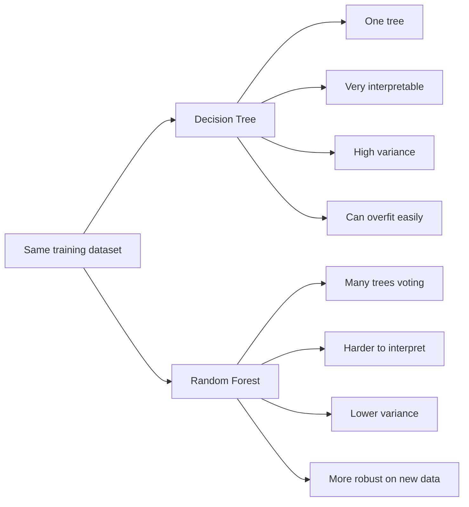

> [!warning] Prerequisites
> This post relies on you understanding [[Decision Tree|Decision Trees]]. You may want to make sure you understand the basics from there before continuing here.

# What is it
Usually people use [[Decision Tree|decision trees]] because they're easy to setup and understand. They're practically just if-else statements that get generated automatically. 

However, one thing decision trees fall short is when having to predict for [new examples](https://esl.hohoweiya.xyz/book/The%20Elements%20of%20Statistical%20Learning.pdf#page=371). Mainly because they tend to find the best way to fit the data you provide them with and are blind to small deviations from it.



# How it works
A random forest is a bunch of decision trees that vote on the correct answer. The catch? No two trees are the same. 

You randomly debuff (inhibit) your decision trees by:
- not showing them your entire dataset 
- not giving them access to all the variables when building them
to introduce some variability in your system. This way you're making your model less categorical. 

> [!example] 
> Imagine wanting to go on a rollercoaster, and they have some strict threshold where if you're 2 cm shorter, you can't ride. Maybe in cases like these, they also measure your grip strength. That way if you're below the minimum threshold, but do bouldering as a hobby, maybe they'll let you pass.

# Where else can I use them
I saw a [StatQuest](https://www.youtube.com/watch?v=sQ870aTKqiM) on how you can use random forests to:
- fill in missing data - say something messed up during recording and a sensor got corrupted
- clustering - you may want to group your data to be able to see emerging patterns

# Anti-overfitting knobs (the important ones)

Since a random forest is made out of multiple decision trees, you'll have access to the same variables you did when training trees.

Common control knobs:
- `n_estimators` - how many trees get to vote (more trees usually = more stable predictions)
- `max_depth` - limits the number of branches a tree can have
- `min_samples_split` - minimum samples to create a new split
- `min_samples_leaf` - minimum samples in each final leaf
- `max_leaf_nodes` - limits total number of leaves
- `max_features` - how many features each tree can consider at each split

# Downsides
Random forests are cool and all, but they can still struggle with very complex patterns, while also becoming a bit harder to read compared to decision trees. 

In my opinion, if you get to the point where you need 20+ trees that are more than 10 layers deep to predict something and it still has low accuracy, you may want to start looking into neural networks.

# Quick starter code (scikit-learn)

If one label shows up way more than the others, `class_weight="balanced"` is worth a shot - otherwise the forest can get away with always voting the common one.

```python
from sklearn.ensemble import RandomForestClassifier
from sklearn.model_selection import train_test_split

# X = your feature matrix, y = labels
X_train, X_test, y_train, y_test = train_test_split(
    X, y, test_size=0.2, random_state=42
)

model = RandomForestClassifier(
    n_estimators=200,
    max_depth=4,
    min_samples_leaf=10,
    random_state=42,
    # class_weight="balanced",  # uncomment if classes are imbalanced
)

model.fit(X_train, y_train)
accuracy = model.score(X_test, y_test)
print(f"Accuracy: {accuracy:.2f}")
```

# Additional Resources
- StatQuest: Random Forests - [YouTube Part1](https://www.youtube.com/watch?v=J4Wdy0Wc_xQ), [YouTube Part2](https://www.youtube.com/watch?v=sQ870aTKqiM)