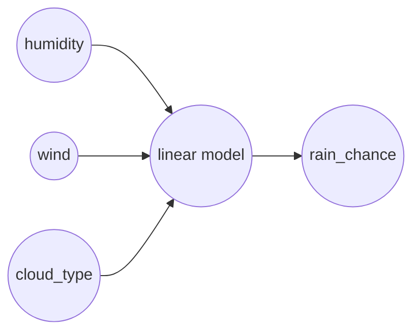

---
tags:
  - deep-learning
draft: false
date: 2026-05-01
---
**Linear regression** is like the 1x1 lego brick of deep learning. It's basically, a way to describe a bunch of scattered points with a line - except that in more than two dimensions it's more of a **hyperplane**.

But why tho? Especially when we have [[Random Forest|Random Forests]] 

Whelp, linear regression is easy to train, easy to debug, and you can still read its internal params. Like, as long as your data is somewhat linearly correlated, it's more than enough.

# One continuous input
Let's actually look at the formula to see how it works.

$$
y = W \cdot x + B
$$

If you remember from other blogposts we called x our input and y our output. In this blogpost, we'll use the case of a weather prediction AI, where x is humidity (0..1) and y is chance of rain (0..1)

> [!warning] Important
> You'll want to **rescale your inputs** between **0 and 1** before you train
>
> If you skip this step and feed in very large or wildly different numbers - learning gets fussy. The model will spend effort fighting the **size** of the numbers instead of learning the **relationship** between them.

We call the other two arguments **W** (weights) and **B** (bias)

The weights tell you how much humidity contributes to it raining, while bias is the baseline chance of it raining in general

These two parameters are not "known", rather they are what we call tunable parameters. These parameters get changed during the "training" phase of our AI. The model will be exposed to a series of examples, and its role is to change W and B such that we have an overlap that's as close as possible to our training data

Now, in our initial example we discussed only one input: **humidity**. But what happens when we have more than one input? 

# Multiple continuous inputs
Say we want to also consider **wind**. Then, instead of one x, we'll need to have x1 - humidity and x2 - wind. Thus, our function will become

$$
y = W_1 \cdot x_1 + W_2 \cdot x_2 + B
$$

Where $W_1$, $W_2$ are the weights that show how much each input variable contributes, and are both tunable parameters

# When inputs are categorical
A thing to keep in mind when building a linear model is the type of your inputs. For example say you want to give as input the **type of clouds** you see on the sky:
1. **No cloud** — clear sky
2. **Nimbus**   — dark gray clouds
3. **Cumulus**  — white clouds

That's a categorical value, and you shouldn't use 1, 2, 3 as raw numeric inputs. Doing so will make the model think that cloud 2 is less important than cloud 3, because it has a higher value.

Instead, you should apply one-hot encoding on your categorical values:
1. no cloud -> \[1, 0, 0]
2. nimbus   -> \[0, 1, 0]
3. cumulus -> \[0, 0, 1]

This way you tell the model that they are 3 independent values that need to be considered separately. 

More concretely, a setup that takes in the two continuous values (humidity and wind) and our 3 categorical values (type of clouds) would look something like this

$$
y = (W_1 \cdot x_1 + W_2 \cdot x_2) + (W_3 \cdot x_3 + W_4 \cdot x_4 + W_5 \cdot x_5) + B
$$

# Summary 
- linear regression predicts a number with **weights** and **bias** on numeric inputs
- those parameters get tuned during training so outputs line up with your data
- categorical inputs need to become numbers - usually **one-hot** - before they go in

If you're curious about how training nudges W and B, see the blogpost on [[Loss Functions]].
